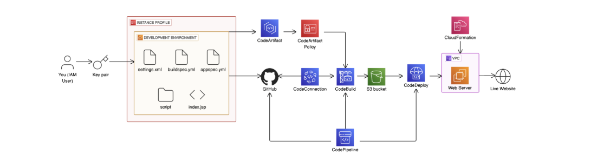
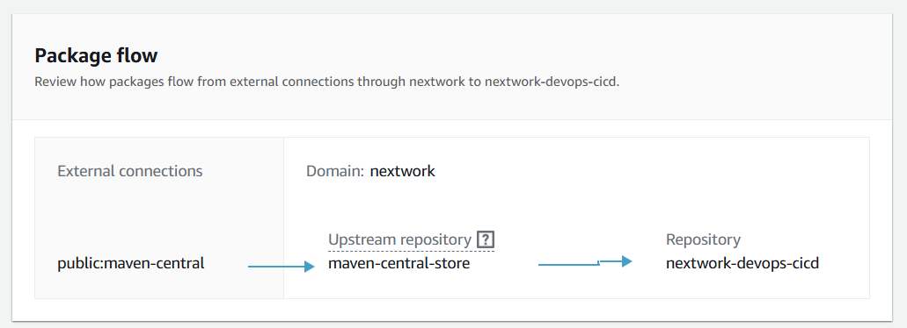
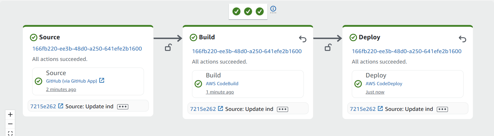
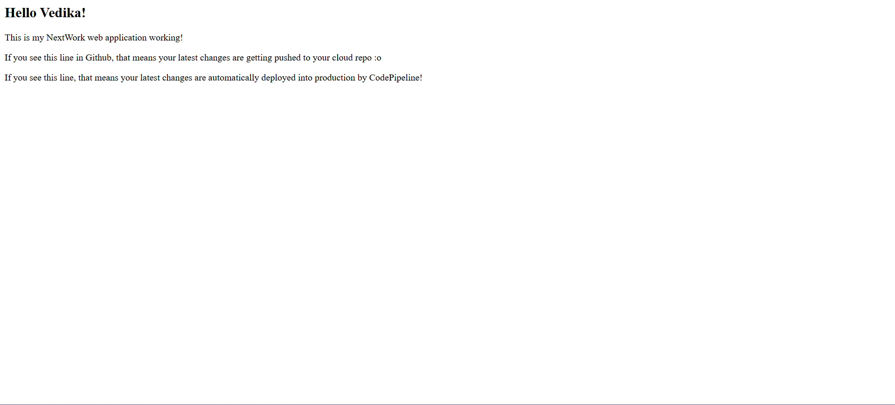

# 💻 Automated CI/CD Pipeline for Java Web App with AWS DevOps  

This project implements a **fully automated CI/CD pipeline** using AWS services to build, test, and deploy a Java-based web application. The pipeline triggers on every GitHub commit, ensuring rapid and reliable deployments to EC2 instances with zero downtime.  

## 🛠️ **Key Services & Tools**  

### **AWS Stack**  
- **AWS CodePipeline** – Orchestrates end-to-end workflow (Source → Build → Deploy)  
- **AWS CodeBuild** – Compiles Java app with Maven using `buildspec.yml`  
- **AWS CodeDeploy** – Deploys artifacts to EC2 using `appspec.yml` hooks  
- **Amazon EC2** – Hosts the production-ready web app  
- **Amazon S3** – Stores build artifacts (ZIP files) securely  
- **AWS CloudFormation** – Automates infrastructure provisioning (VPC, EC2, IAM)  
- **AWS IAM** – Enables secure role-based permissions for pipeline stages  

### **Development Tools**  
- **GitHub** – Version control with webhook-triggered pipeline starts  
- **VS Code** – IDE with AWS Toolkit and SSH integration for EC2  
- **Apache Maven** – Dependency management and build automation  

## 🔄 **Pipeline Workflow**  

1. **Source Stage**  
   - Monitors GitHub repository for commits (branch: `main`).  
   - Triggers pipeline automatically via webhook.  

2. **Build Stage**  
   - CodeBuild executes `buildspec.yml` to:  
     - Install dependencies (Java, Maven).  
     - Run unit tests.  
     - Package artifacts into `app.zip` (stored in S3).  

3. **Deploy Stage**  
   - CodeDeploy fetches `app.zip` from S3.  
   - Executes lifecycle hooks (`install_dependencies.sh`, `start_server.sh`) defined in `appspec.yml`.  
   - Rolls back on failure (if configured).  

## 🎯 **Key Outcomes**  
✅ **Full Automation** – From `git push` to production deployment in minutes.  
✅ **Infrastructure as Code (IaC)** – CloudFormation templates for reproducible environments.  
✅ **Security** – IAM roles limit permissions; GitHub tokens replace passwords.  
✅ **Scalability** – Ready for multi-instance deployments (adjust `deployment-config` in CodeDeploy).  

## 📸 Screenshots & Demo  

### CI/CD Pipeline Diagram

### Package Flow

### Web Application

### Pipeline Deployment

### Deployed Application

## 📝 **LinkedIn Project Log**  
Follow my daily progress and lessons learned:  
🔗 [LinkedIn Post](www.linkedin.com/in/vedika-gangil-2b793a251)  

## ✨ Author  
[Vedika Gangil]  
  
  
